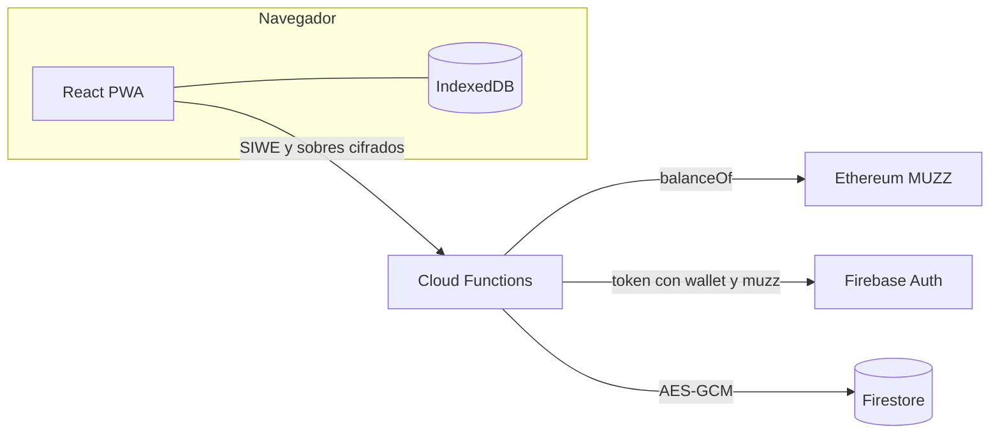

# MuzzChat

Mensajería cifrada para wallets que mantienen al menos **10 millones de MUZZ** en Ethereum mainnet. La interfaz está en español. La interfaz es oscura, con el naranja como color de acción.

MuzzChat vive solo en esta carpeta. No usa el sitio estático de la raíz ni el workflow `.github/workflows/static.yml`. El proyecto de Firebase de producción `pulsari` está prohibido: el código se niega a arrancar si el id del proyecto es ese.

## Arquitectura



- **Cliente:** Vite, React y TypeScript. Es una PWA. Las claves privadas se quedan en IndexedDB.
- **Entrada:** selector EIP-6963 y WalletConnect. La wallet firma un mensaje SIWE.
- **Servidor:** Cloud Functions en TypeScript (`functions/`). Firestore no acepta lecturas ni escrituras del cliente. Las reglas niegan todo. El cliente solo habla con Auth y con las funciones.
- **Sesión:** si la firma es válida (ECDSA o EIP-1271) y el saldo llega al mínimo, `verifyLogin` crea un custom token `{ wallet, muzz: true }`.
- **Red:** el saldo se lee con `eth_call` a `balanceOf` del ERC-20 `0xef3dAa5fDa8Ad7aabFF4658f1F78061fd626B8f0` (18 decimales), usando `ETH_RPC_URL`.
- **Revisión:** cada 30 minutos una función programada vuelve a leer el saldo. Si baja del mínimo, pone `muzz: false`, revoca los refresh tokens y marca al holder. Las funciones también miran ese documento, así que el corte no espera a que caduque el JWT.
- **Emulador:** Auth `9099`, Functions `5001`, Firestore `8080`, Pub/Sub `8085`, Hosting `5000`, UI `4000`. El id local es `demo-muzzchat`. Pub/Sub hace que las funciones programadas carguen; el reloj de 15 y 30 minutos corre en el proyecto desplegado.

## Las tres claves, en simple

Cada mensaje lleva tres piezas. Ninguna de ellas, sola, abre el texto.

1. **Clave efímera del emisor.** Para ese mensaje se crea una X25519 nueva y la privada se tira al terminar. Viaja solo la pública.
2. **Clave de un solo uso del receptor.** El dispositivo publica varias X25519. La identidad Ed25519 del dispositivo firma cada una, y la wallet firma un texto que ata esa identidad a la dirección. Quien escribe pide una al servidor. El servidor la entrega y la marca como usada en una transacción, para que nadie más la reciba. Al descifrar, el receptor borra la privada y publica más si quedan pocas.
3. **Capa del servidor.** El sobre ya cifrado se guarda envuelto con AES-256-GCM (`SERVER_WRAP_KEY`). `fetchMessages` quita esa envoltura solo si el token tiene `muzz: true`, el documento del holder sigue activo y la wallet es emisor o receptor. Esa capa no entiende el mensaje: por debajo sigue el texto cifrado con XChaCha20-Poly1305.

La clave de contenido sale así:

`HKDF( DH(efímera, claveDeUnUso) || DH(identidadDelEmisor, claveDeUnUso) )`

Entran el id del mensaje y las dos wallets. El emisor firma con Ed25519 la cabecera y el ciphertext. El receptor comprueba esa firma, comprueba que la identidad pública sea la registrada para esa wallet y solo entonces descifra.

El servidor ve direcciones, ids de hilo, fechas y claves públicas. No tiene la clave de contenido.

## Borrado

- `markRead` escribe `readAt` una sola vez. Una segunda llamada no lo mueve.
- El cliente borra su copia local cuando se cumple la misma regla.
- Cada 15 minutos el servidor borra:
  - mensajes leídos con más de 24 horas desde `readAt`;
  - mensajes no leídos con más de 7 días desde `createdAt`;
  - prekeys ya consumidas, con una hora de margen para que un envío que ya las reclamó pueda terminar;
  - nonces y cupos de reclamación caducados.
- Los ids de hilo son 128 bits aleatorios. La lista de chats dice «Cifrado»: no hay vista previa del texto.

## Límites de la v1

- Un dispositivo por wallet. Firmar en otro navegador sustituye la identidad y tira las prekeys públicas que quedaban. El historial del navegador anterior deja de poder descifrarse.
- Lo enviado desde otra sesión se ve como aviso, no como texto: la clave efímera no se guardó aquí.
- No hay grupos, adjuntos ni notificaciones push. El cliente pregunta al servidor cada pocos segundos.
- Si las dos personas crean el hilo a la vez, pueden quedar dos hilos.
- Hace falta que el receptor tenga prekeys publicadas. Si se agotan, hay que abrir la app para reponerlas.
- Alguien con saldo puede quemar prekeys ajenas. Hay un tope de 40 reclamaciones por hora y por wallet.
- La revisión de saldo mira hasta 500 holders por pasada y no revoca si la RPC falla.
- Un corte de saldo puede tardar hasta 30 minutos. Un login por debajo del mínimo revoca en el acto.
- EIP-1271 llama a `isValidSignature(bytes32,bytes)` con el hash EIP-191. El valor mágico es `0x1626ba7e`.
- Perder los datos del navegador es perder el historial.
- No es una auditoría. Los metadatos no van cifrados.
- La sincronización trae páginas de 100 mensajes por lado.

## Puesta en marcha

Hace falta Node 22 y Java (el emulador de Firestore lo usa).

```bash
cd muzzchat
npm ci
npm ci --prefix functions
cp .env.example .env.local
cp functions/.env.example functions/.env
npm run emulators
```

En otra terminal:

```bash
cd muzzchat
npm run dev
```

Abre la URL de Vite. Con una wallet de prueba puedes evitar la RPC de saldo **solo en el emulador**, poniendo en `functions/.env`:

```bash
MUZZ_DEV_BALANCE_WEI=10000000000000000000000000
```

Eso son 10 millones de tokens con 18 decimales. En producción se ignora.

Para WalletConnect crea un project id en Reown y ponlo en `VITE_WALLETCONNECT_PROJECT_ID`. Sin eso, el selector EIP-6963 sigue funcionando.

## Variables de entorno

Cliente (`.env.local`):

| Variable | Uso |
| --- | --- |
| `VITE_FIREBASE_API_KEY` | Configuración web. En el emulador vale `demo-api-key`. |
| `VITE_FIREBASE_AUTH_DOMAIN` | Dominio de Auth. |
| `VITE_FIREBASE_PROJECT_ID` | Id del proyecto. Local: `demo-muzzchat`. Nunca `pulsari`. |
| `VITE_FIREBASE_APP_ID` | App id. En el emulador vale un valor de demostración. |
| `VITE_USE_EMULATORS` | `true` para Auth y Functions en localhost. |
| `VITE_WALLETCONNECT_PROJECT_ID` | Project id público de WalletConnect. No es un secreto, pero no hace falta commitearlo. |

Funciones (`functions/.env`):

| Variable | Uso |
| --- | --- |
| `ETH_RPC_URL` | RPC HTTPS de Ethereum mainnet. |
| `MUZZ_TOKEN_ADDRESS` | Contrato. Por defecto el de arriba. |
| `MIN_MUZZ_WHOLE` | Mínimo en tokens enteros. Por defecto `10000000`. El wei es `MIN_MUZZ_WHOLE * 10n ** 18n`. |
| `SERVER_WRAP_KEY` | 32 bytes en base64. `replace-me` solo arranca en el emulador. |
| `SIWE_ALLOWED_DOMAINS` | Dominios permitidos, separados por coma. Vacío solo en el emulador. |
| `MUZZ_DEV_BALANCE_WEI` | Saldo falso. Solo si `FUNCTIONS_EMULATOR=true`. |

No hay secretos en el repositorio.

## Despliegue

Crea un **proyecto de Firebase nuevo**. No reutilices `pulsari`.

```bash
cd muzzchat
npx firebase login
npx firebase use --add
```

Elige el proyecto nuevo. Genera una clave de envoltura y escribe los dominios reales:

```bash
node -e "console.log(require('crypto').randomBytes(32).toString('base64'))"
```

Rellena `functions/.env` con la RPC, el mínimo, la clave y `SIWE_ALLOWED_DOMAINS` (por ejemplo `muzzchat.web.app`). Rellena `.env.local` con la config web de ese proyecto y `VITE_USE_EMULATORS=false`. Luego:

```bash
npm run build
npm --prefix functions run build
npx firebase deploy --only functions,firestore,hosting --project TU_PROYECTO_NUEVO
```

Hosting sirve `dist/`. Las funciones salen de `functions/lib`, que empaqueta también el código de `shared/`.

El workflow de GitHub Pages de la raíz publica el repo tal cual y no construye esta app. MuzzChat se despliega aparte. El workflow `.github/workflows/muzzchat.yml` solo corre cuando cambian `muzzchat/**`: tests, build del cliente y build de las funciones.

## Tests

```bash
cd muzzchat
npm test
node scripts/smoke-login.mjs
```

`smoke-login.mjs` habla con el emulador ya arrancado: pide un nonce, firma un SIWE con una wallet local y comprueba que el custom token trae `wallet` y `muzz: true`. Hace falta `MUZZ_DEV_BALANCE_WEI` en `functions/.env` si no hay RPC.

Vitest cubre el viaje de ida y vuelta del cifrado, un ciphertext alterado, una clave de un solo uso distinta, el segundo descifrado tras borrar la privada, el borde del saldo (justo el mínimo pasa, un wei menos no) y el borrado con un reloj fijo. También se comprueba que la firma Ed25519 de libsodium verifica en el código del servidor y que el SIWE del cliente se puede leer.
